# KSOR Database ERD

```mermaid
erDiagram
    %% ─── Reference / Master ───────────────────────────────────
    ref_hospital {
        varchar hospital_code PK
        varchar hospital_name
        varchar hospital_short_name
        boolean is_active
    }

    ref_timepoint {
        varchar timepoint_code PK
        varchar display_name_ko
        varchar display_name_en
        integer sort_order
        integer day_offset_from_sx
        integer window_start_day
        integer window_end_day
    }

    ref_diagnosis_code {
        varchar diagnosis_code PK
        varchar display_name_ko
        varchar display_name_en
    }

    ref_procedure_code {
        varchar procedure_code PK
        varchar display_name_ko
        varchar display_name_en
        enum spinal_region
    }

    ref_prom_instrument {
        varchar instrument_code PK
        varchar display_name_ko
        varchar display_name_en
        varchar version_label
    }

    ref_prom_question_bank {
        uuid question_bank_id PK
        varchar instrument_code FK
        varchar question_code
        integer display_order
        text question_text_ko
        varchar response_type
    }

    %% ─── Auth ─────────────────────────────────────────────────
    auth_role_catalog {
        enum role_code PK
        varchar role_name_ko
        text role_description
        boolean is_system_role
    }

    auth_user_account {
        uuid user_id PK
        varchar hospital_code FK
        varchar login_id UK
        text password_hash
        varchar password_algo
        varchar full_name
        varchar email
        varchar phone
        enum role_code FK
        boolean is_first_login
        boolean password_reset_required
        boolean is_active
        boolean is_locked
        integer failed_login_count
        timestamptz last_login_at
        timestamptz locked_at
        text locked_reason
        varchar department
        varchar specialty
        varchar license_number
        enum approval_status
        uuid approved_by FK
        timestamptz approved_at
        text rejection_reason
        timestamptz created_at
        timestamptz updated_at
    }

    auth_session {
        uuid session_id PK
        uuid user_id FK
        char refresh_token_hash UK
        uuid access_jti
        timestamptz expires_at
        timestamptz revoked_at
    }

    auth_login_event {
        uuid login_event_id PK
        uuid user_id FK
        varchar login_id
        enum event_type
        boolean success
        timestamptz occurred_at
    }

    auth_password_reset_token {
        uuid reset_token_id PK
        uuid user_id FK
        char token_hash UK
        enum reset_channel
        timestamptz expires_at
    }

    %% ─── Patient / Vault ──────────────────────────────────────
    patient_patient {
        varchar patient_id PK
        varchar hospital_code FK
        varchar patient_initial
        enum sex
        smallint birth_year
        boolean is_active
    }

    vault_patient_identity {
        varchar patient_id PK
        varchar hospital_code FK
        bytea local_mrn_enc
        char local_mrn_sha256
        bytea full_name_enc
        bytea phone_enc
        char phone_sha256
        bytea birth_date_enc
    }

    %% ─── Clinical ─────────────────────────────────────────────
    clinical_case_record {
        uuid case_id PK
        varchar hospital_code FK
        varchar patient_id FK
        varchar registration_id UK
        date visit_date
        date surgery_date
        varchar diagnosis_code FK
        varchar procedure_code FK
        enum case_status
        boolean is_locked
        uuid surgeon_user_id FK
    }

    clinical_case_initial_form {
        uuid case_id PK
        varchar hospital_code FK
        varchar patient_id FK
        jsonb comorbidities
        text diagnosis_detail
        numeric symptom_duration_weeks
        jsonb additional_attributes
    }

    clinical_case_extended_form {
        uuid case_id PK
        varchar hospital_code FK
        varchar patient_id FK
        varchar surgery_level
        varchar approach_type
        varchar laterality
        integer operation_minutes
        integer estimated_blood_loss_ml
        varchar anesthesia_type
        boolean implant_used_yn
        date discharge_date
    }

    clinical_case_outcome_form {
        uuid case_id PK
        varchar hospital_code FK
        varchar patient_id FK
        boolean complication_yn
        text complication_detail
        boolean readmission_30d_yn
        boolean reoperation_yn
        text final_note
    }

    clinical_case_followup_visit {
        uuid followup_id PK
        uuid case_id FK
        varchar hospital_code FK
        varchar patient_id FK
        varchar timepoint_code FK
        date visit_date
        text clinician_note
        boolean complication_yn
        boolean reoperation_yn
    }

    clinical_case_memo {
        uuid memo_id PK
        uuid case_id FK
        varchar hospital_code FK
        varchar patient_id FK
        enum visibility
        text memo_text
    }

    clinical_case_lock_history {
        uuid lock_event_id PK
        uuid case_id FK
        varchar hospital_code FK
        varchar patient_id FK
        boolean is_locked
        text reason
        uuid changed_by FK
    }

    %% ─── Survey / PROM ───────────────────────────────────────
    survey_prom_request {
        uuid request_id PK
        uuid case_id FK
        varchar hospital_code FK
        varchar patient_id FK
        varchar timepoint_code FK
        enum token_status
        timestamptz requested_at
        timestamptz expires_at
    }

    survey_prom_draft {
        uuid request_id PK
        uuid case_id FK
        varchar hospital_code FK
        varchar patient_id FK
        jsonb answer_payload
        timestamptz last_saved_at
    }

    survey_prom_submission {
        uuid submission_id PK
        uuid request_id FK
        uuid case_id FK
        varchar hospital_code FK
        varchar patient_id FK
        varchar timepoint_code FK
        jsonb answer_payload
        timestamptz submitted_at
    }

    %% ─── Messaging ───────────────────────────────────────────
    messaging_outbox {
        uuid outbox_id PK
        varchar hospital_code FK
        enum channel
        enum status
        jsonb payload
        timestamptz created_at
    }

    messaging_alimtalk_template {
        varchar template_code PK
        varchar hospital_code FK
        text template_body
    }

    messaging_message_attempt {
        uuid attempt_id PK
        uuid outbox_id FK
        integer attempt_number
        enum status
        text error_detail
    }

    %% ─── Ops ─────────────────────────────────────────────────
    ops_data_export_request {
        uuid export_id PK
        uuid requested_by FK
        varchar hospital_code FK
        enum scope
        enum approval_status
    }

    %% ═══ Relationships ═══════════════════════════════════════

    %% Hospital is the multi-tenancy root
    ref_hospital ||--o{ auth_user_account : "employs"
    ref_hospital ||--o{ patient_patient : "registers"
    ref_hospital ||--o{ clinical_case_record : "owns"

    %% Auth role catalog
    auth_role_catalog ||--o{ auth_user_account : "assigned to"

    %% User account self-reference (approver)
    auth_user_account ||--o{ auth_user_account : "approves (approved_by)"

    %% Patient core
    patient_patient ||--|| vault_patient_identity : "identity (encrypted)"
    patient_patient ||--o{ clinical_case_record : "has cases"

    %% Case record → sub-forms (1:1)
    clinical_case_record ||--o| clinical_case_initial_form : "initial data"
    clinical_case_record ||--o| clinical_case_extended_form : "surgery detail"
    clinical_case_record ||--o| clinical_case_outcome_form : "outcomes"

    %% Case record → multi-row children
    clinical_case_record ||--o{ clinical_case_followup_visit : "follow-up visits"
    clinical_case_record ||--o{ clinical_case_memo : "memos"
    clinical_case_record ||--o{ clinical_case_lock_history : "lock events"

    %% Case record → FK to reference
    ref_diagnosis_code ||--o{ clinical_case_record : "diagnosed as"
    ref_procedure_code ||--o{ clinical_case_record : "treated with"

    %% Follow-up visit → timepoint
    ref_timepoint ||--o{ clinical_case_followup_visit : "at timepoint"

    %% Survey / PROM flow
    clinical_case_record ||--o{ survey_prom_request : "PROM requested"
    ref_timepoint ||--o{ survey_prom_request : "for timepoint"
    survey_prom_request ||--o| survey_prom_draft : "draft answers"
    survey_prom_request ||--o| survey_prom_submission : "final submission"

    %% PROM instruments
    ref_prom_instrument ||--o{ ref_prom_question_bank : "has questions"

    %% Auth relationships
    auth_user_account ||--o{ auth_session : "active sessions"
    auth_user_account ||--o{ auth_login_event : "login history"
    auth_user_account ||--o{ auth_password_reset_token : "reset tokens"
    auth_user_account ||--o{ clinical_case_record : "surgeon / coordinator"

    %% Messaging
    messaging_outbox ||--o{ messaging_message_attempt : "delivery attempts"

    %% Export
    auth_user_account ||--o{ ops_data_export_request : "requests export"
```

## Enums

| Enum | Values |
|------|--------|
| `auth.app_role` | `ADMIN`, `STEERING`, `PI`, `CRC`, `AUDITOR`, `SYSTEM` |
| `auth.signup_status` | `PENDING`, `APPROVED`, `REJECTED` |
| `auth.reset_channel` | `EMAIL`, `ALIMTALK`, `ADMIN` |
| `auth.auth_event_type` | `LOGIN_SUCCESS`, `LOGIN_FAILURE`, `ACCOUNT_LOCKED`, `LOGOUT`, `TOKEN_REFRESH`, `PASSWORD_RESET_*` |
| `clinical.case_status` | `DRAFT`, `ACTIVE`, `LOCKED`, `CLOSED`, `ARCHIVED` |
| `clinical.spinal_region` | `CERVICAL`, `THORACIC`, `LUMBAR`, `SACRAL`, `MULTI`, `UNKNOWN` |
| `clinical.memo_visibility` | `PRIVATE`, `HOSPITAL`, `ADMIN` |
| `survey.token_status` | `READY`, `SENT`, `OPENED`, `VERIFIED`, `SUBMITTED`, `EXPIRED`, `FAILED`, `REVOKED` |
| `messaging.message_channel` | `KAKAO_ALIMTALK`, `EMAIL`, `SMS` |
| `messaging.message_status` | `QUEUED`, `LEASED`, `SENT`, `DELIVERED`, `OPENED`, `FAILED`, `CANCELLED`, `EXPIRED` |
| `ops.export_scope` | `SITE`, `GLOBAL` |
| `ops.approval_status` | `REQUESTED`, `APPROVED`, `REJECTED`, `EXPIRED`, `DOWNLOADED`, `CANCELLED` |
